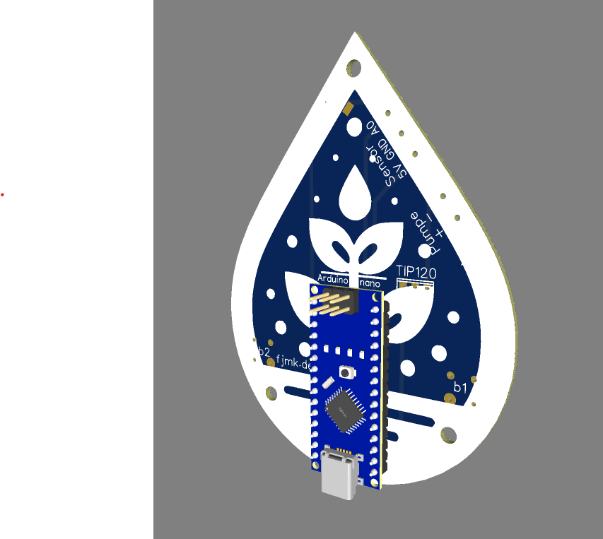
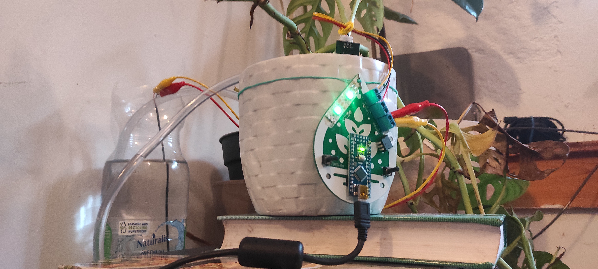

# Pflanzenbewässerungssystem

Dieses Projekt ist ein Pflanzenbewässerungssystem, das in C++ für Arduino implementiert wurde, wie in der [main.cpp](src/main.cpp) Datei zu sehen ist.

## Platine

Die Gerber Dateien, mit denen die Platine zum Projekt bestellt werden kann sind im Verzeichnis zu finden. ("Gerber_Files_PCB_Pflanzenbewässerung_Nano_2024-01-12_v2.zip") einfach herunterladen und z. B. auf jlcpcb.com, ... bestellen

## Überblick

Das System misst den Feuchtigkeitsgehalt des Bodens und bewässert die Pflanze, wenn der Feuchtigkeitsgehalt unter einen bestimmten Schwellenwert fällt. Es beinhaltet auch Funktionen zum Speichern und Lesen von Daten aus dem EEPROM, zum Verarbeiten von Tastendrücken und zur Steuerung von LEDs.

## Schlüsselfunktionen

- `setup()`: Stellt den Anfangszustand des Systems ein.
- `loop()`: Hauptzyklus, in dem das System den Feuchtigkeitsgehalt überprüft und entscheidet, ob die Pflanze bewässert werden soll.
- `saveToEEPROM()`: Speichert Daten im EEPROM.
- `readFromEEPROM()`: Liest Daten aus dem EEPROM.
- `printAllValues()`: Druckt alle Werte für Debugging-Zwecke.
- `getMoistureReading(int iterations_to_average, int delay_per_iteration)`: Erhält die Feuchtigkeitsmessung vom Sensor.
- `isMoistureBelowThreshold(uint16_t moisture)`: Überprüft, ob der Feuchtigkeitsgehalt unter dem Schwellenwert liegt.
- `handleButtons()`: Verarbeitet Tastendrücke.
- `button1_onClick()`, `button2_onClick()`, `both_buttons_onClick()`, `both_buttons_longPress()`: Funktionen zur Verarbeitung spezifischer Tastendruckereignisse.
- `stateMachine(int watering_time, int pause_after_watering, int delay_per_iteration, int iterations_to_average)`: Steuert den Zustand des Systems.
- `handleLEDs()`: Steuert die LEDs.
- `interpolate_color(uint8_t r1, uint8_t g1, uint8_t b1, uint8_t r2, uint8_t g2, uint8_t b2, uint8_t &r, uint8_t &g, uint8_t &b, float t)`: Interpoliert zwischen zwei Farben.

## Abhängigkeiten

Das Projekt hängt von der Adafruit NeoPixel-Bibliothek ab, wie in der [platformio.ini](platformio.ini) Datei angegeben.

## Bau und Betrieb

Dieses Projekt wird mit PlatformIO gebaut und betrieben. Bitte beziehen Sie sich auf die [PlatformIO-Dokumentation](https://docs.platformio.org/page/projectconf.html) für weitere Informationen zum Bau und Betrieb des Projekts.

## LED-Anzeigen

Die obere LED zeigt die Feuchtigkeit im Blumentopf an (von trocken: rot zu okay: grün zu feucht: blau), und die untere LED zeigt den Schwellenwert (gleicher Farbverlauf).

## Beispielfoto - mit Platine

So könnte das Projekt am ende aussehen.

